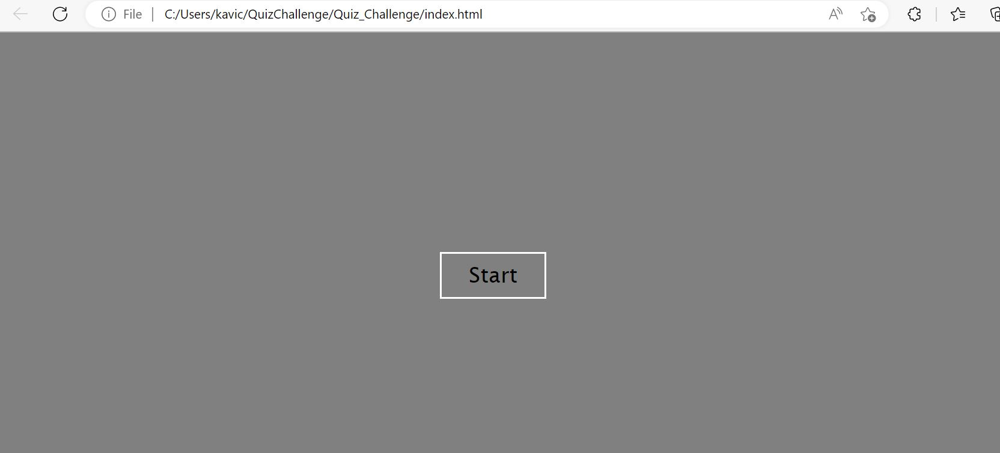
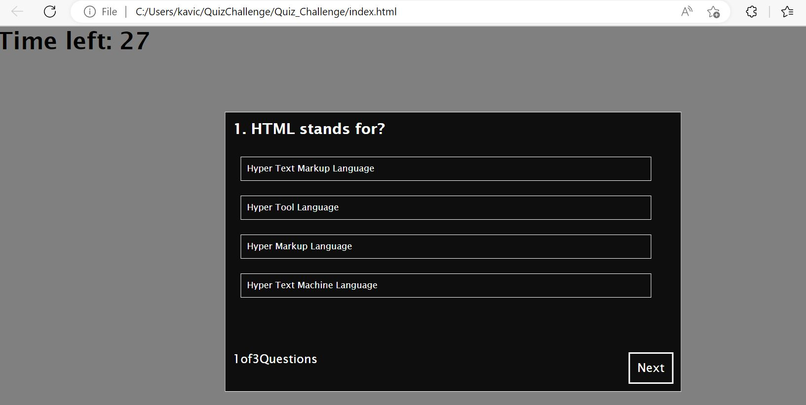
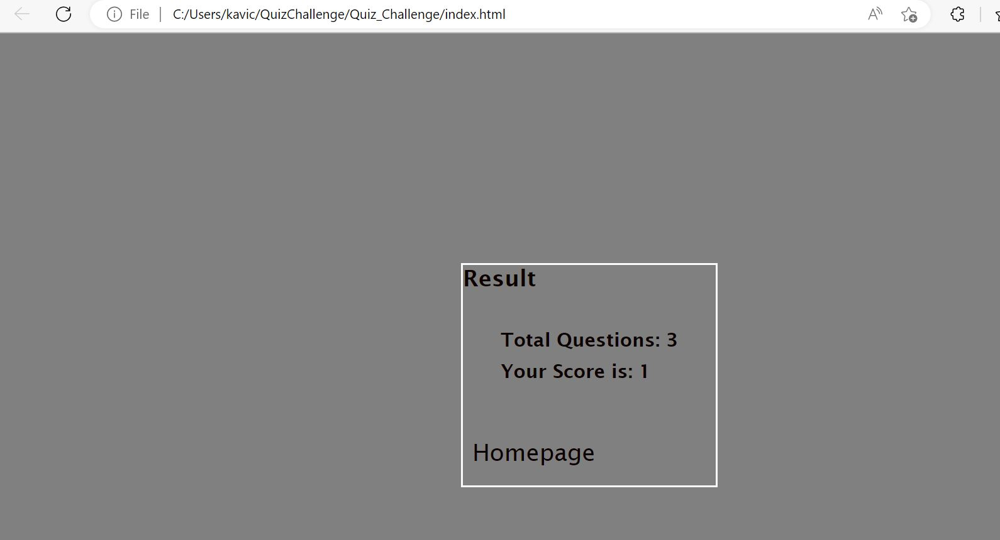

# Web APIs: Code Quiz 

For this challenge we created timed coding quiz with multiple-choice questions. This app is written from scratch.

Here are the user story and Acceptance Criteria

USER STORY

AS A coding boot camp student 

I WANT to take a timed quiz on JavaScript fundamentals that stores high scores 
SO THAT I can gauge my progress compared to my peers

ACCEPTANCE CRITERIA

GIVEN I am taking a code quiz 
WHEN I click the start button 
THEN a timer starts and I am presented with a question 
WHEN I answer a question 
THEN I am presented with another question 
WHEN I answer a question incorrectly 
THEN time is subtracted from the clock 
WHEN all questions are answered or the timer reaches 0 
THEN the game is over 
WHEN the game is over 
THEN I can save my initials and my score

## Mock-Up

Here are the steps we followed to complete this timed quiz challenge:

1. When the user click the START button then the quiz starts with timer for 30 seconds to complete 3 questions. 

2. When the user click correct answer there will not any change in timer. But if the user click wrong answer then 3 seconds will be subtracted from the timer. 

3. When the user reach the last question and click the button finish then the timer stops and the score is shown in result page. 

4. Homepage button will be avaliable to take the quiz again. 

Here is the screenshot of the completed quiz challenge. 

Here is the link for the deployed page-

Here is the link for the GitHub Page-
